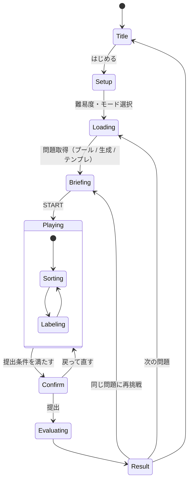

# Label Drop（practice IA シリーズ）— 3D 仕分けトレーニング 仕様書

> **v0.3** / 2026-09-30（v0.2: 公開範囲・フロント構成・グループ数を決定 ／ v0.3: Workers 無料プランに確定、ログインは当面なしで切り替え式に、ブロックの見た目をサンプルGLBに合わせる）
> 対象: IAの「4つのシステム」のうち **① 組織化（まとめる）** と **② ラベリング（名前をつける）** を鍛える3Dゲーム
> 既存資産: `index.html`（IAワンシートLP）、`practice.html/js/css`（2Dプロトタイプ：テンプレ3題・ペアF1採点・タップ選択・Undo）、`assets/`（イラスト）

---

## 0. サマリー

- **遊び方**: 3D空間に浮かぶキーワードブロックをトレイ（3〜5個）へ投げ入れる。各トレイに名札（ラベル）を付けて提出すると、模範解答との比較と講評が出る。
- **出題**: Workers AI で作った問題を **問題プール（D1）に貯めて** 出題する。AIが使えない時はテンプレJSONから出す。**どんな状況でも遊べなくならない**ようにする。
- **採点**: 主軸は **決定的スコア**（ローカル計算でトークン0）。AIの役割は「ラベルの評価」「別解の判定」「講評」に絞る。
- **予算**: 無料枠の 10,000 Neurons/日（**09:00 JST にリセット**）を自前で計測し、HUD に「AI ENERGY」として表示する。残量に応じて3段階で自動的に節約する。
- **UI**: 既存LPのトンマナ（深いネイビーにシアンのグロー）を引き継いだ、プロ品質のゲームUI。**3D（投げる快感）とDOM（正確な確認・入力）のハイブリッド**にする。
- **利用者**: 基本は自分用。共有しても **最大30人程度**。**当面はログインなし**。ただしバックエンドには Cloudflare Access 前提の認証層を実装しておき、`AUTH_MODE` を切り替えるだけでログイン必須にできるようにする（8.5）。
- **プラン**: **Workers 無料プランで運用する（決定）**。上限を超えても課金はされず、エラーになるだけ。

---

## 1. コンセプト

### 1.1 学習目標

| 力 | ゲーム内の行為 | 評価で見る点 |
|---|---|---|
| 組織化 | ブロックをトレイに仕分ける | 分類軸が一貫している／まとまりがある／重なりがない／粒度が揃っている |
| ラベリング | トレイに名札を付ける | 中身が予測できる／表記が揃っている／利用者の言葉になっている／互いに区別できる |

### 1.2 体験の核

**「投げる快感（手）」×「名付ける思考（頭）」**。仕分けはテンポよく、ラベルはじっくり考えてもらう。
3Dは飾りではない。散らかった情報を自分の手で整えていく手応えを、体で感じてもらうために使う。

### 1.3 デザイン原則

1. **答えを色で漏らさない**: 未分類のブロックはすべて同じ無彩色にする。ブロックに色が付くのは、ユーザーが入れたトレイの色だけ（既存イラストのように、グループごとに色分けしてはいけない）。
2. **3Dは気持ちよく、2Dは正確に**: 投げる操作は3Dで、確認・修正・文字入力はDOMのペインで行う。
3. **どの操作にも代替手段を用意する**: 投げる／ドロップ／タップで選んで入れる／キーボードのどれでも操作できるようにする。
4. **模範解答は「正解」ではなく「一つの設計例」**: 採点でも文言でも別解を認める。
5. **AIが止まってもゲームは止まらない**。

---

## 2. 学習設計

### 2.1 お題 = 3つの柱（LPの「3つを考えて、4つで整える」をそのまま使う）

各問題には **ブリーフ** を付ける。ラベルの良し悪しは「この利用者がこの場面で、ラベルを見ただけで中身を予測できるか」で判断させる。**単なるカテゴリ当てクイズにはしない。**

| 柱 | 項目 | 例 |
|---|---|---|
| ユーザー（だれに） | `brief.user` | 初めて海外旅行に行く大学生 |
| コンテクスト（どんな場面で） | `brief.context` | 出発2週間前、スマホで準備を調べている |
| ゴール | `brief.goal` | 準備から帰国までを案内するサイトのグローバルナビ |
| コンテンツ（なにを） | `items[]` | 浮かんでいるキーワード群 |

### 2.2 難易度

| | かんたん | ふつう | むずかしい |
|---|---|---|---|
| キーワード数 | 15 | 20〜24 | 25〜30 |
| 模範のグループ数 | 3 | 4 | 5 |
| 曖昧なキーワード | 0 | 1〜2 | 3〜5 |
| お題 | 身近な題材 | Webサイト・アプリ | 業務システム・利用者が複数 |
| グループ数の表示 | 「推奨 3」 | 「推奨 3〜5」 | 表示しない |
| 別解（altSchemes） | なし | 任意 | 1つ以上 |

> **決定（v0.2）**: 模範のグループ数は **難易度に応じて3〜5** にする。常に5グループだと、3箱から始めて3〜4箱で提出した人のペア一致度が構造的に下がってしまうため。

### 2.2.1 ブロック数（v0.4 で追加）

- HUD の「BLOCKS」ステッパーで **10〜30個** を1個単位で選べる（±ボタンか直接入力。範囲外の値は丸める）。選んだ値は保存しておく。
- 仕分けの途中で変更すると盤面を配り直すため、確認ダイアログを出す。
- **テンプレ出題**: 30語から、**すべての模範グループが均等に残るように**グループを巡回しながら選ぶ（例: 10個・5グループなら各2個）。
- **AI出題（P4）**: `itemCount` をユーザーの選んだ値で渡す。模範のグループ数は難易度で決める（2.2）が、**1グループに最低3語** を保つため `groupCount ≤ floor(itemCount / 3)` に抑える（例: 10語なら最大3グループ）。
- 表示: 語数が少ないときはブロックを最大1.25倍まで大きくし、行間も広げて画面を使い切る。

### 2.2.2 箱の数（v0.4 で決定: キーワード数から自動で決まり、固定）

箱の数を自分で決めるのは実務のIAでは重要なスキルだが、練習の初期には難しすぎて挫折の原因になる。そこで、**箱の数はキーワード数から自動で決め、プレイ中は増減できない** ことにする。

**式**: `箱の数 = ceil(キーワード数 ÷ 6)`（3〜5 の範囲に収める）

| キーワード数 | 箱の数 | 1箱あたり |
|---|---|---|
| 10〜18 | 3 | 約3〜6個 |
| 19〜24 | 4 | 約5〜6個 |
| 25〜30 | 5 | 5〜6個 |

- **根拠（経験則）**: カードソートでは1グループに5〜9個前後で落ち着くことが多く、この仕様でも「1箱3〜8個」を目安にしてきた。6個を基準に割れば、分けすぎ（1〜2個の箱）とまとめすぎ（十数個の箱）を両方防げる。
- **模範との整合**: 出題するキーワードは、**箱の数と同じ数の模範グループ** から均等に選ぶ（テンプレートは1グループ6語なので `ceil(n÷6)` グループあれば必ず足りる）。これで、箱の数と模範のグループ数が常に一致し、採点で数の差による不利が生じない。
- **AI出題（P4）**: `groupCount = ceil(itemCount ÷ 6)` で生成を依頼する（2.2 の「難易度でグループ数を決める」は、この式に置き換える）。
- **将来の「むずかしい」モード**: 箱の数を自分で決める（3〜5、±で増減可）練習を上級者向けに用意する。固定 → 目安あり → 自由 と段階を踏んで、実務の力につなげる。

### 2.2.3 レベルアップモード（v0.5 で実装）

「箱の数を自分で決めるのも、分野の知識も、最初は重すぎる」という試遊の結果を受けて、**補助を1つずつ外していくスモールステップ** にする。モードは HUD の「MODE」で切り替える（**レベルアップ**／**無制限**）。進み具合は端末に保存する。

| Lv | ブロック | 箱 | 1箱の数 | 定員の表示 | ラベル | お題 |
|---|---|---|---|---|---|---|
| 1 | 6 | 2 | 3・3 | あり（それ以上は入らない） | 任意 | 身近な題材 |
| 2 | 9 | 3 | 3・3・3 | あり | 任意 | 身近な題材 |
| 3 | 9 | 3 | 3・3・3 | あり | **必須** | 身近な題材 |
| 4 | 12 | 3 | 4・4・4 | あり | 必須 | ＋身近なサービス |
| 5 | 12 | 4 | 3・3・3・3 | あり | 必須 | 同上 |
| 6 | 12 | 3 | 5・4・3（ばらばら） | あり | 必須 | 同上 |
| 7 | 15 | 4 | ばらばら | あり | 必須 | ＋Webサイト（全題） |
| 8 | 18 | 4 | ランダム（3〜6） | **なし**（合計のみ） | 必須 | 全題 |
| 9 | 24 | 5 | ランダム | なし | 必須 | 全題 |
| 10 | 10〜30 | 自動 | すべてランダム | なし | 必須 | 全題（＝無制限モードと同じ条件） |

- **答え合わせ（ゴール）**: すべてのブロックを箱に入れ、ラベルが必須のレベルでは全箱に名前を付けると、「答え合わせ」ボタンが押せる。
- **採点**: 箱と模範グループを最もよく合う組み合わせで対応させ、正解数を数える（ローカル計算）。結果画面では、間違ったブロックと「正しくはこの箱」、自分のラベルと模範のラベルを並べて表示する。3D上でも、間違ったブロックが赤く、正解が緑に光る。
- **星**: 正解率100%で★3、80%以上で★2、60%以上で★1。ラベルに注意が残っていると最大★2、切り口ヒントを使うと★−1、おまかせを使った回は練習扱いで★0。
- **レベルアップ**: 各レベルで★を5つためると次のレベルへ進む。
- 答え合わせのあとは盤面をロックし、「次の問題へ」で新しい盤面を配る（答えを見てから出し直して星を稼ぐことはできない）。

### 2.2.4 お題の3段階と「分野の知識」の問題（v0.5）

試遊で、難しさの原因が2つ見つかった。

1. **お題を把握していないと、分ける基準が決まらない**
2. **その分野を知らないと、キーワードの意味が浮かばない**

どちらも分類のスキルとは別の問題なので、次の3つで取り除く。

- **A. ブリーフィング**: 盤面を配るたびに、まずお題（だれが／どんなとき／何のため）を読んでから始める。プレイ中もステージ左上にお題カードを出しておき、押すと読み直せる。
- **B. キーワードの意味**: ブロックにマウスを乗せる（PC）／長押しする（スマホ）と、一言の説明を出す。全30題・900語に説明を付けた。説明は言葉の意味だけを書き、どのグループかは示さない。
- **C. お題の3段階**: 知識がいらない題材から始める。

| 段階 | 数 | 例 | 使うレベル |
|---|---|---|---|
| 身近な題材 | 16 | 冷蔵庫の中身、スーパーの売り場、文房具の引き出し、家事の分担表、小学校の時間割 | Lv1〜 |
| 身近なサービス | 8 | 市立図書館、総合病院、スマホの設定画面、ネット通販のマイページ、家計簿アプリ | Lv4〜 |
| Webサイト | 6 | 旅行準備、新入社員の社内ポータル、暮らしの手続き、大学、求人、コーポレートサイト | Lv7〜 |

- 合計30題。すべて5グループ×6語で、ブリーフ・切り口ヒント・全語の説明を持つ。
- AIで出題するようになったら（P4）、同じ形式（段階・ブリーフ・説明付き）で生成して追加していく。

### 2.3 モード（同じ問題JSONから作れるので追加コストはかからない）

| モード | やること | 鍛える力 | 用途 |
|---|---|---|---|
| **フリーソート**（メイン） | 仕分け＋ラベル | 両方 | 本編 |
| クローズドソート | ラベル付きのトレイに仕分けるだけ | 組織化 | チュートリアル・初心者向け |
| ネーミング | 仕分け済みのトレイに名前を付けるだけ | ラベリング | 3分ドリル |
| デイリー（将来） | 全員が同じ問題を解き、みんなのラベルと比べる | 両方 | 継続プレイ |

### 2.4 ヒント ＝ 考え方ガイド（v0.4 で実装。答えではなく「考える手順」を教える）

HUD の「ヒント」ボタン（`H` キー）で、ステージ左に **考え方ガイド** を開く。AIは使わない（トークン0）。

**① 8ステップの手順（どのお題でも共通）**: この順に進めば、自分で仕分けと名付けができるように作る。

| # | ステップ | やること（要約） |
|---|---|---|
| 1 | 「誰が・どんな場面で」をつかむ | お題を読み、「この人は何をしに来る？」を一言で言う |
| 2 | ブロックを「何のため？」で読む | 名前ではなく目的に言い換える（パスポート→出国するためのもの） |
| 3 | 確実なペアから始める | 「絶対に一緒」の2つを3組ほど、それぞれ別のトレイに |
| 4 | 切り口を1つに決める | 時間の流れ／やりたいこと／対象／場所 から1つ選び、全トレイを揃える |
| 5 | 残りを振り分け、迷うものは保留 | 最後に「この利用者ならどっちの箱を開ける？」で決める |
| 6 | 箱の大きさを見直す | 半分以上が1箱なら割る、1〜2個の箱は合流を検討（目安は1箱3〜8個） |
| 7 | ラベルを付ける | 中身を全部覆う／利用者の言葉／2〜8文字／形を揃える／「その他」禁止 |
| 8 | ラベルだけでテストする | ラベルだけで中身を予測できるか、2箱で迷わないか |

**② いまのあなたへ（コーチ）**: 盤面から今のステップを判定し、具体的な一言を出す（ルールベース）。

- 未着手 → ステップ3（ペア作り）
- 40%未満 → ステップ4
- 未分類が残っている → ステップ5
- 偏りがある → ステップ6
- ラベルが未入力や不備 → ステップ7
- 完了 → ステップ8

**③ このお題の切り口ヒント（1段深いヒント）**: 押したときだけ表示する。切り口と例を**1つだけ**示し、グループ名は並べない（例:「旅の"時間の流れ"で。たとえば"出発する前にやること"は1つのまとまりになりそう。その次は？」）。**使ったことは記録し、P1 の採点で −5点** にする。AI出題（P4）では、生成時に同じ粒度の `axisHint` を一緒に作る。

**④ ラベルのライブヒント**: 各トレイのラベル入力欄の下に、4.5 のルールのうち最も重要な1件を出す。

### 2.4.1 おまかせ仕分け（v0.4 で追加）

画面上部の、ブロックが浮かんでいる空間を **ペンディングエリア** と呼ぶ。インベントリペインのボタンを押すと、ペンディングエリアからブロックが自動で箱へ飛び込む。

| ボタン | 動作 | 用途 |
|---|---|---|
| 少しおまかせ（3個） | ペンディングエリアからランダムに3個を、模範の分け方で入れる。**プレイヤーが入れたブロックは動かさない** | 手が止まったときのきっかけ |
| 全部おまかせ・ラベル練習 | すべてのブロックを模範の分け方に並べ替える（入力済みのラベルは残す。途中まで仕分けていたら確認ダイアログを出す） | ラベリングだけの練習（2.3 のネーミングモード相当） |

- **箱の割り当て**: 模範の各グループを、そのグループのブロックが一番多く入っているトレイに割り当てる（多数決）。足りなければ空のトレイを使い、それもなければトレイを追加する（5個まで）。
- **アニメーション**: 左から右へ波のように順番に発射する（全部は90ms間隔、少しは260ms間隔）。
  - 発射前: ペンディングエリアで手前に飛び出して小刻みに震える（ため）。
  - 飛行中: 高い放物線で1回転し、回転をほどきながら箱の底に表向きで着地する。
  - 着地: 「コトッ」の音とトレイのパルスで知らせる。
  - 同じ箱に同時に飛ぶブロックは、それぞれ別の置き場所を先に確保するので重ならない。
- **記録**: 使ったことは `assistUsed` に記録し、P1 の採点に反映する（少し: 1回ごとに減点、全部: 構造スコアは対象外にしてラベル評価だけにする）。

### 2.4.2 箱（トレイ）の形状（v0.4 で `box-model-sample.glb` に合わせて改修）

- 平面で見た角が丸い、1枚の角丸長方形の枠にする（押し出し＋面取りで、縁の上端も丸める）。平面の角の半径は 0.14、壁の厚みは 0.11。
- 前面は低い壁にし、奥に厚みのある背板ブロック（高さ 0.82）を置く。名札パネルは背板の前面上部に、少し後ろへ傾けて付ける。
- ブロックは、背板の前面と前の壁の内側のあいだ（中の空間）の底面に、表向きで並べる。

---

## 3. ゲームフロー



- 仕分けとラベル入力は **いつでも行き来できる**（フェーズで区切らない）。
- 一時停止と設定はオーバーレイで開き、どの状態からでも使える。
- 途中の状態は localStorage に自動保存し、リロードしても続きから再開できる。

### 3.1 提出条件（すべて満たすと提出ボタンが押せる）

- [ ] 未分類のキーワードが0個
- [ ] 空のトレイが無い（提出時に「空のトレイを削除して提出」を選べる）
- [ ] 中身のあるトレイすべてにラベルがある（空白だけのものは不可）
- トレイの数は **3〜5**。削除は4個以上あるときだけできる。
- 同じラベルの重複は **警告** に留め、提出は止めない。

ボタンが押せないときは、何が足りないかをチェックリストで常に表示しておく。

---

## 4. 画面仕様

### 4.1 レイアウト

**デスクトップ（1280px以上）**

```
┌───────────────────────────────────────────────────────────────────────┐
│ HUD: logo | brief title · level | progress 18/30 | AI ENERGY | ? ⚙ ⏸   │ 56px
├─────────────────────────────────────────────────────┬─────────────────┤
│ [BRIEF card: USER / CONTEXT / GOAL]  (collapsible)  │ INVENTORY PANE  │
│                                                     │ (360–400px)     │
│                3D STAGE                             │ ┌ tray card 1 ┐ │
│        floating keyword blocks                      │ │ label input │ │
│                                                     │ │ chips       │ │
│                                                     │ │ live hint   │ │
│                                                     │ └─────────────┘ │
│   [tray 1]  [tray 2]  [tray 3]  [ + ]               │ unsorted (12) ▾ │
│ [undo] [redo] [hint 0/3]                            │ checklist       │
│                                                     │ [ SUBMIT → ]    │
└─────────────────────────────────────────────────────┴─────────────────┘
```

**モバイル（767px以下）**

```
┌─────────────────────────┐
│ HUD (compact)           │
├─────────────────────────┤
│ 3D STAGE (~60vh)        │
│   floating blocks       │
│ [t1] [t2] [t3] [+]      │
├─────────────────────────┤
│ bottom sheet (3 stops)  │  ← peek: progress+submit / half: trays / full: 編集
└─────────────────────────┘
```

タブレット（768〜1279px）: インベントリは右側のドロワーにして、開閉できるようにする。

### 4.2 3Dステージ

| 要素 | 仕様 |
|---|---|
| カメラ | PerspectiveCamera（fov 40前後）でほぼ固定。ポインタに合わせて ±2° のパララックスだけ付ける。**自由回転はさせない**（読みにくくなり、酔いやすくもなるため） |
| 浮遊エリア | 画面の上から6割程度のボリューム。初期配置はポアソンディスクサンプリングで重ならないように散らす |
| 浮遊の動き | simplexノイズで 0.05〜0.1Hz、振幅 0.15〜0.3。回転は ±6° まで。ブロック同士が近づきすぎたら弱い斥力で離す |
| 可読性 | ブロックはカメラに対して常にほぼ正面を向ける。ホバーすると手前に 0.3 浮き上がり、1.1倍になる。モバイルでは長押しで大きくプレビューする |
| 再レイアウト | ブロックが減ってきたら残りを中央に寄せ、残りの数に応じて少しずつ大きくする |
| トレイ | 画面下部に緩い円弧状に並べる。3→5個に増減したときはアニメーションで再配置する。名札（ホログラム風のプレート）と個数バッジを付ける |
| トレイの中身 | 入れたブロックを縮小して積み上げる（見えるのは8個まで、それ以上は「+N」） |
| トレイの追加 | 円弧の端に「＋」のゴースト枠を置く。押すとトレイが床からせり上がり、対応するラベル入力にフォーカスが移る |
| 背景 | 深いネイビーのグラデーション、奥に消えていくグリッドの床（LPの `.grid` の3D版）、控えめなデータ粒子、フォグ |

### 4.3 インタラクション

**投げる（メイン操作）**

1. **つかむ**: pointerdown → レイキャストでブロックを選ぶ。つかんだブロックは手前に浮き、ほかのブロックは少し暗くなり、全トレイが「受け入れ候補」として淡く光る。
2. **動かす**: ブロックはカメラに正対する平面上でポインタを追う（lerp 0.35）。直近80msの速度を記録しておく。
3. **離す**: 判定の優先順は次のとおり。
   - a. ポインタがトレイの画面上の当たり判定（見た目より30%大きく取る）の中にある → **ドロップ**
   - b. 離したときの速度が閾値（目安900px/s）を超えている → **スロー**。投げた方向から ±20° 以内で最も近いトレイに向かって **エイムアシスト**（ホーミング）をかける
   - c. どちらでもない → その場で浮遊に戻る（**ミスしても罰則なし**）
4. **ガイド**: ドラッグ中に行き先のトレイが決まっていれば、点線の放物線ガイドを出してそのトレイを強く光らせる。
5. **着地**: 350〜550msのベジェ曲線の弧で飛ばし、トレイに吸い込ませる。トレイが自分の色でパルスし、個数バッジがカウントアップする。モバイルでは `navigator.vibrate(10)` で軽く振動させる。

**代替操作**

| 操作 | 方法 |
|---|---|
| タップで選んで入れる | ブロックをタップして選択 → トレイ（3Dでもペインのカードでもよい）をタップ（既存プロトの挙動を引き継ぐ） |
| ペインにドロップ | ブロックをキャンバスの外に引き出し、インベントリのカードの上で離す |
| ペイン内で移動 | チップを別のカードへドラッグする（dnd-kit を使い、キーボードでも操作できるようにする） |
| 取り出す | トレイ内のブロックかチップをクリック →「未分類に戻す」または「移動先…」 |
| キーボード | `Tab`/矢印でブロックを巡回、`1`〜`5` で送る、`L` で選択中トレイのラベル入力へ、`Ctrl+Z`/`Ctrl+Shift+Z` で Undo/Redo、`?` でショートカット一覧 |

**連動**: ペインのチップにホバーすると、3D側で該当ブロックがハイライトされる。逆方向も同様にする。

**Undo/Redo**: 移動・トレイ追加/削除・ラベル確定を履歴として積む。ラベルの入力中は1回の編集にまとめる。

### 4.4 インベントリペイン

- **ヘッダ**: `YOUR GROUPS 3/5` と「＋ トレイを追加」ボタン
- **トレイカード**:
  - 色の帯・記号（◆●▲■★）・番号: 色だけに頼らず見分けられるようにする
  - ラベル入力（最大20文字、12文字を超えたら注意）と個数バッジ
  - キーワードチップの一覧
  - ライブヒント（4.5）
  - メニュー（削除・並べ替え）
- **未分類リスト**: 折りたたみ式。スクリーンリーダーで3Dの代わりに使う主な導線も兼ねる。
- **フッタ**: 提出チェックリスト（✓分類 30/30、✓ラベル 3/3、✓空トレイなし）と提出ボタン

### 4.5 ラベル入力（日本語で使う前提の必須要件）

- **3D上に独自のテキスト入力は作らない**。必ずDOMの `<input>` を使う（IMEでの変換に対応するため）。3Dの名札はその入力内容を映すだけにする。
- `compositionstart`〜`compositionend` の間は Enter で確定・提出しない。
- 3Dの名札をクリックしたら、ペインの対応する入力にフォーカスを移す。
- 入力中は **ライブヒント** を出す。ルールベースなのでトークン0で、学習効果が一番大きい部分になる。

| ルール | レベル | 表示文言（例） |
|---|---|---|
| 空欄 | エラー | ラベルを入力してください |
| 「その他」「いろいろ」「など」「misc」 | 注意 | 中身が予測しにくい受け皿のラベルです |
| 13文字以上 | 注意 | ナビに収まる長さ（目安12文字以内）にしましょう |
| 重複（NFKC正規化後に一致） | 注意 | 同じラベルが複数あります |
| 形式が混在（「〜する／〜したい」と名詞が混ざる） | 注意 | ラベルの表記の形式を揃えましょう |
| 中のキーワードと完全に一致 | ヒント | 1語ではなく、全体を表す言葉にしましょう |
| 1トレイに全体の50%超／1〜2個しか入っていない | ヒント | まとまりの粒度を見直してみましょう |

> ルールは `shared/rules.ts` に実装し、クライアント（ライブヒント）とサーバー（オフライン採点）の両方で使う。

### 4.6 BRIEFカード

- 左上にオーバーレイで置き、たためるようにする。USER / CONTEXT / GOAL と、出題元のバッジ（`AI生成` / `作り置き` / `テンプレート`）を表示する。
- プレイ開始前に BRIEFING 画面で大きく見せてから、カードの形に縮めて左上に収める（トランジション）。

### 4.7 リザルト画面

演出: カメラが引く → トレイが横一列に並ぶ →「ANALYZING」のスキャン演出 → 模範のトレイがゴーストとして向かい側に出現する。

| 領域 | 内容 |
|---|---|
| スコア | 総合スコアとランク（S/A/B/C/D）。サブスコアは平易な言葉で表示する：「模範との一致」「まとまり」「ラベルの伝わりやすさ」「ラベルの揃い方」「重なりのなさ」（レーダーチャート） |
| **対応図（主役）** | 左にあなたのグループ、右に模範のグループを置いたアルビオン（サンキー）図。帯の太さは共有しているキーワードの数。帯にホバーするとキーワード名を出す |
| ずれたキーワード | 「あなた: 移動・交通 → 模範: 渡航の準備」の一覧（曖昧キーワードには「どちらも妥当」の印を付ける） |
| ラベル比較 | あなたのラベル／模範のラベル／別案（altLabels）／AIの一言 |
| 別解の判定 | 「あなたの分類は『利用者別』という別の軸として一貫しています」（AI） |
| 講評 | 良い点（最大3つ）→ 改善点（最大3つ）→ 今回の学び（1行、ワンシートの概念にリンク） |
| 操作 | 同じ問題に再挑戦／次の問題／タイトルへ（将来: 結果カードを画像で保存） |

表示の注意:
- AIの講評には「AIによる参考意見です」と小さく添える。
- AIを使っていない採点には「簡易評価」のバッジを付ける。

### 4.8 AI ENERGY メーター（HUD）

- 10セグメントのバーと %。**「Neurons」という用語はユーザーには見せない**（詳細はポップオーバーに入れる）。
- ポップオーバーの表示例:

  ```
  本日のAIエネルギー（全員共有） 62%
  問題生成 あと約35回 ／ AI評価 あと約90回
  あなたの今日の残り: AI評価 12/15 ・ テーマ指定生成 2/3
  リチャージ 09:00 JST（あと 3時間12分）
  現在のモード: AI生成
  ```

| モード | 条件（残量） | 色 | 挙動 |
|---|---|---|---|
| FULL | 30%以上 | シアン | その場での生成も可、AI評価あり |
| SAVER | 10〜30% | アンバー | 生成は止め、作り置きかテンプレから出題。AI評価はあり |
| OFFLINE | 10%未満、または上限到達のエラー | グレー | テンプレから出題し、ローカル採点のみ |

- モードが変わったらトーストで知らせる（例:「AIエネルギーが少なくなったため、作り置きの問題から出題します」）。
- 定期ポーリングはしない。各APIのレスポンスに予算情報を含めて返し、そのたびに更新する。

---

## 5. アートディレクションとデザインシステム（プロ仕様UI）

### 5.1 トンマナ

**「情報仕分け装置のコンソール」**。`assets/ia-workshop-sorter.png` の世界観（散らばったカード → 装置 → 光るトレイ）をそのまま3Dにする。

- キーワード: **Precise / Calm / Luminous / Tactile**
- やらないこと: ブルームやネオンのかけすぎ、読めなくなるほどの傾き、学習の集中を削ぐ派手なエフェクト、パーティクルの常時多用

### 5.2 デザイントークン（LP `index.html` の値を正とする）

**カラー**

| トークン | 値 | 用途 |
|---|---|---|
| `--bg-0` | `#050C1C` | 背景 |
| `--bg-1` | `#0C1B37` | パネル |
| `--bg-2` | `#102850` | パネルの強調 |
| `--line` | `rgba(85,218,255,.25)` | 罫線・枠 |
| `--text-1` | `#F3F8FF` | 本文 |
| `--text-2` | `#A8BBD5` | 補助テキスト |
| `--accent` | `#45E5FF` | 主要アクション・フォーカス |
| `--success` | `#27D2BB` | 一致・完了 |
| `--warning` | `#FFBF36` | 注意 |
| `--danger` | `#FF745E` | エラー |

**トレイのパレット**（必ず色と記号をセットで使う）

| # | 色 | 記号 |
|---|---|---|
| 1 | Cyan `#45E5FF` | ◆ |
| 2 | Amber `#FFBF36` | ● |
| 3 | Coral `#FF745E` | ▲ |
| 4 | Violet `#B6A1FF` | ■ |
| 5 | Mint `#7CF0B5` | ★ |

> トレイの色と警告の色（アンバー／コーラル）がぶつかるので、**警告は必ずアイコンと文言で表し、色だけで伝えない**。

**タイポグラフィ**

| 役割 | フォント | 備考 |
|---|---|---|
| 和文（本文・ブロック・ラベル） | Noto Sans JP 400/500/700/900 | |
| HUD・見出しの欧文 | Space Grotesk 500/700 | LPのキッカー（大文字・字間 .18em）を踏襲 |
| 数値 | JetBrains Mono | tabular-nums（カウンタ・メーター・スコア） |

- スケール: 12 / 14 / 16 / 20 / 24 / 32 / 48
- 行間: 本文 1.5、見出し 1.2

**スペーシング・角丸・影**

- スペーシング: 4px基準（4, 8, 12, 16, 24, 32, 48）
- 角丸: チップ 6 / 入力・ボタン 10 / カード 16 / ピル 999
- ガラスパネル: `--bg-1` を72% ＋ `backdrop-filter: blur(12px)` ＋ `--line` 1px ＋ 上辺に `rgba(255,255,255,.06)` のハイライト
- グロー: `0 0 24px rgba(69,229,255,.25)`。**フォーカス／アクティブ／プライマリにだけ使う**

**モーション**

| トークン | 時間 | 用途 |
|---|---|---|
| micro | 120ms | ホバー・押下 |
| base | 200ms | 状態の変化 |
| panel | 320ms | ドロワー・シート |
| cinematic | 800〜1200ms | カメラ・リザルトの演出 |

- イージング: out `cubic-bezier(.2,.8,.2,1)` / in-out `cubic-bezier(.65,0,.35,1)`。3Dは減衰スプリングを使う。

### 5.2.1 デザインテーマ（v0.3 で追加）

HUD の「DESIGN」から切り替えられる。選んだテーマは localStorage に保存し、再読み込みせずにその場で切り替わる。

| テーマID | 見た目 | 3D |
|---|---|---|
| `midnight-blue`（初期値） | 上記のトークン。深いネイビーにシアンのグロー | 青い半透明ガラスのブロック、濃紺メタルのトレイ、ブルームは強め |
| `pastel-rainbow` | **目に優しいくすみパステル**（v0.4で調整）。ラベンダーグレーの背景に、純白を使わないミルク色の面。虹色のグラデーションは進捗バーとHUD下線の **細い部分だけ** に使う | ブロックは画面の左→右でパステルの虹色に変わる（**装飾のみで、正解のグループとは無関係**）。パールラベンダーのトレイ、ブルームは控えめ |

| `kraft-paper` | **温かく眩しくない工作室**（v0.4で追加）。クラフト紙色の背景に、生成り色の面。アクセントはテラコッタ `#A24A2F`。HUD下線と進捗バーには、トレイ5色（テラコッタ／マスタード／オリーブ／ティール／藍）を並べた帯を使う | セージ色のすりガラスブロック、つや消しの木のトレイ（metalness 0・粗さ 0.72）。ブルームはほぼなし。「コトッ」という木箱の音とも合う |

- **pastel-rainbow の配色ルール（チカチカ防止）**:
  - 大きな面に純白を使わない（背景 ≈ L*91、パネル ≈ L*95）。
  - 彩度の高い色は、線・バッジ・グラデーションの帯など小さな面積だけに使う。3Dブロックの虹色は彩度52%に抑える。
  - 小さな文字にグラデーションをかけない（ちらついて読みにくいため、単色のアクセント `#6A54B0` を使う）。
  - コントラスト比: 本文 9.7:1、補助文字 5.1:1、アクセント 5.4:1（いずれも WCAG AA 以上）。
  - ブルームとキラキラ（パーティクル）は、ほぼ切る。
- 実装: DOMのトークンは `styles.css` の `:root[data-theme="…"]`、3D側の値（背景・フォグ・グリッド・ブロック色と透明度・トレイ色・名札色・ブルームなど）は `src/theme/themes.ts` の `THEMES` に置く。
- テーマを追加するときは、この2か所に1ブロックずつ足すだけでよい。

### 5.3 3Dのルック

| 要素 | 仕様 |
|---|---|
| ブロック | **`wordblock-sample.glb` の比率に合わせる**: 奥行きは高さの約0.82倍、角の丸みは高さの約9%。幅は文字数に合わせて伸ばす（1.0〜2.6ユニット）。本体は **透明感の強い半透明ガラス**（midnight-blue はペリウィンクル `#6B86CE` で不透明度0.28。同じ色でうっすら自己発光させて、暗い背景でも青く見えるようにする。値はテーマごとに持つ）。浮遊中は1個ずつ少し傾けて、上面と側面を見せて厚みを感じさせる |
| ブロックの文字 | **文字だけ不透明度100%**。**濃いグレーの文字に白い縁取り**を付けたポップなステッカー調で、太さは Noto Sans JP Black（900）。本体より後に描画して、半透明の影響を受けないようにする。前面に置いた平面に **CanvasTexture** で描く。必ず `document.fonts.load()` でフォントの読み込みを待ってから描画する（待たないと代替フォントで焼き付いてしまう）。テクスチャはDPRに合わせた解像度で作り、mipmapとanisotropyを有効にする。13文字以上は2行に折り返す |
| トレイ | 装置の受け皿のような形。内側を発光させ、手前に色の帯を入れる。名札は scanline シェーダを入れた半透明プレート |
| ライティング | `RoomEnvironment` から作ったPMREMの環境光＋キーライト1灯＋リムライト1灯 |
| ポストエフェクト | 選択的ブルーム（発光部分だけ、半解像度）、ごく弱いビネット、SMAA。トーンマッピングは AgX |
| 陰影 | 影の計算はしない。床にコンタクトシャドウを1枚置いて軽く済ませる |

> 3Dの日本語テキストに troika/MSDF を使わない理由: AIが出題するので使われる文字が事前に分からず、日本語フォントを事前にサブセット化できない。CanvasTexture ならWebフォントをそのまま使える。

### 5.4 サウンド

Web Audio API を使う（音量スライダーとミュートを付ける）。

| イベント | 音 |
|---|---|
| つかむ | 柔らかいクリック |
| 投げる | ウーシュ（速度に応じてピッチを変える） |
| 着地 | **「コトッ」という物理音**（音程なし）。接触のクリック音＋箱の胴鳴り＋小さな跳ね返りの2打。毎回わずかに揺らぎを入れて単調にしない |
| ミス | 低いバウンス音 |
| 提出 | 上昇音 |
| リザルト | 解析音 → 開示音 |

アンビエントのドローン音も入れる（初期はOFF）。

### 5.5 UI品質基準（Definition of Done）

- [ ] すべての操作要素に default / hover / focus-visible / active / disabled / loading / error の各状態がデザインされている
- [ ] すべてのタスクがマウスなしで完了できる
- [ ] コントラストは WCAG 2.2 AA を満たす（本文 4.5:1、UI 3:1）。タッチターゲットは44px以上
- [ ] IMEでの変換中に誤作動しない
- [ ] 非同期処理にはすべて loading / empty / error の表示がデザインされている（スケルトン、リトライ導線）
- [ ] 色・余白・時間はトークンだけで指定している（マジックナンバーを使わない）
- [ ] 初回操作でカクつかない（ローディング中に `renderer.compile()` でシェーダを事前にコンパイルしておく）
- [ ] 文言トーンが揃っている: 短く、能動的に。専門用語は初出で説明する（例:「分類軸（まとめ方の切り口）」）
- [ ] 文言は辞書ファイルで一元管理する（現状は ja のみだが、i18n できる構造にしておく）

### 5.6 アクセシビリティ

- トレイは色＋記号＋番号の3つで見分けられる。
- `prefers-reduced-motion` のときは浮遊を止めて格子状に並べ、カメラ演出はフェードに置き換える。
- 3Dキャンバスには `aria-hidden` を付け、同じ操作ができる **DOMの並行リスト**（未分類リスト＋トレイカード）を用意する。
- 移動結果は live region で読み上げる（既存プロトの `announcement` を引き継ぐ）。
- モーダルではフォーカスを閉じ込め、閉じたら元の位置に戻す。
- 設定で「文字サイズ（標準／大）」「モーション（標準／控えめ／停止）」「色覚サポート（記号を強調）」を切り替えられるようにする。

### 5.7 パフォーマンス予算

| 項目 | 目標 |
|---|---|
| フレームレート | 中位ノートPCで60fps、中位スマホで30fps以上を安定して出す |
| 描画 | ドローコール120以下、三角形20万以下 |
| DPRの上限 | デスクトップ2、モバイル1.5 |
| 画質の自動調整 | フレーム時間が20msを2秒超えたら、ブルーム → DPR → ポストエフェクトの順に落とす |
| 読み込み | LPのJSは250KB gz以下。ゲームのチャンク（three.js＋R3F）は遅延読み込み。インタラクティブになるまで4Gで3秒以内 |
| メモリ | 問題が切り替わるたびにテクスチャとジオメトリを確実に `dispose` する |

---

## 6. 採点・評価の仕様

### 6.1 3層構造（安いものから順に使う）

| 層 | 手段 | コスト | 役割 | OFFLINE時 |
|---|---|---|---|---|
| L1 | ローカル計算（`shared/scoring.ts`） | 0 | 構造スコア、ルールチェック、対応付け | ○ |
| L2 | 埋め込み（bge-m3） | 1回あたり1 Neuron未満 | ラベルの代表性・区別しやすさ、模範ラベルとの意味の近さ | × |
| L3 | LLM | 1回あたり約60〜180 Neurons | ラベルのルーブリック評価、別解の判定、講評文 | × |

### 6.2 構造スコア（L1）

- **ペア一致F1**: 既存プロトの `score()` を移植する。「同じ箱に入れたペア」が模範と一致しているかを測る指標で、箱の順番・数・名前に左右されない。
- **別解対応**: 模範と各 `altSchemes` それぞれに対してF1を計算し、**最大値** を採用する（別解は ×0.95 する）。
- **対応付け**: ユーザーのグループと模範のグループの重なり行列を作り、重なりの合計が最大になる組み合わせを選ぶ（5! = 120通りなので全探索で十分）。これをアルビオン図とラベル比較の組み合わせに使う。
- **曖昧キーワード**: `ambiguous.altGroupIds` に含まれるグループに入れた場合は、ずれとして数えない。
- 内部指標として ARI も計算しておく（キャリブレーション用で、表示はしない）。

### 6.3 ラベルスコア

| 観点 | L1（ルール） | L2（埋め込み） | L3（LLMルーブリック 1〜5） |
|---|---|---|---|
| 伝わりやすさ | 長さ、「その他」系 | — | clarity |
| 代表性 | 中身と完全一致していないか | cos(ラベル, 中身の重心) | representativeness |
| 揃い方 | 形式の混在 | — | consistency（全体） |
| 重なりのなさ | 重複 | 自分の重心との類似度 − 他の重心との類似度の最大値 | exclusivity（全体） |
| 模範との近さ | — | cos(ラベル, 模範ラベルと altLabels の最大値) | — |

### 6.4 総合スコア

```
structure = 100 × max(F1_ref, 0.95 × F1_alt...)
labeling  = AI:      LLMルーブリックを 0–100 に正規化（L2 を補正に使う）
            OFFLINE: ルール減点方式（100 − 注意×8 − ヒント×3）＋「簡易評価」表示
bonus     = 別解の判定が valid なら +5（上限100）
total     = round(0.6 × structure + 0.4 × labeling + bonus − 5 × hintsUsed)
rank      = S ≥ 90 / A ≥ 80 / B ≥ 65 / C ≥ 50 / D
```

- 経過時間は記録して表示するが、**スコアには入れない**（IAはじっくり考える作業なので、急がせない）。

---

## 7. AI 仕様

### 7.1 モデル選定（2026-09-30 時点の公式価格。無料プランで使えるもの）

| 用途 | モデル | Neurons / 1Mトークン（入力 / 出力） | 1回の概算* |
|---|---|---|---|
| 生成・評価（**第一候補**） | `@cf/google/gemma-4-26b-a4b-it` | 9,091 / 27,273 | 生成 約95 / 評価 約64 |
| 生成・評価（比較候補） | `@cf/zai-org/glm-4.7-flash` | 5,500 / 36,400 | 生成 約117 / 評価 約68 |
| 品質重視の比較候補 | `@cf/openai/gpt-oss-120b` | 31,818 / 68,182 | 生成 約252 / 評価 約182 |
| 参考（JSONモードに公式対応） | `@cf/meta/llama-3.3-70b-instruct-fp8-fast` | 26,668 / 204,805 | 生成 約654（出力単価が高い） |
| 埋め込み | `@cf/baai/bge-m3`（多言語） | 1,075 / — | 1未満 |
| 埋め込み（日本語特化の比較候補） | `@cf/pfnet/plamo-embedding-1b` | 1,689 / — | 1未満 |

\* 概算の前提: 生成は入力1,500＋出力3,000トークン（推論トークンを含む）、評価は入力2,500＋出力1,500トークン。**日本語のトークン数は変動が大きいので、P4で実測して係数を補正する。**

- モデルIDは `wrangler.jsonc` の `vars` に置き、コードを変えずに差し替えられるようにする。P4では10題の固定入力でA/B比較して決める。
- 推論（reasoning）付きのモデルは推論トークンも出力として課金される。設定できるモデルでは推論の effort を low にする。
- 公式のJSONモード対応リストに載っているのは主に旧モデル。**どのモデルでも zod で検証し、失敗したら1回だけ再試行する** 前提で作る。
- 一部の大型モデル（kimi-k2.6、glm-5.2 など）は2026年7月以降 **有料プラン専用** になっている。上の表は無料プランで使えるモデルから選んだ。

**無料枠で遊べる回数の目安**（上限9,000、gemma）:

- 作り置きから出題して評価だけAIを使う場合: 約64/プレイで **約140プレイ/日**
- その場で生成して評価もする場合: 約159/プレイで **約56プレイ/日**

### 7.2 問題生成パイプライン

```
① サーバーがパラメータを抽選する（LLMはランダム性が低いので、多様性はサーバー側で作る）
   domain: 地域図書館 / 市役所 / 大学 / 病院 / ネットスーパー / 旅行予約 / 社内ポータル /
           SaaS設定画面 / 家計簿アプリ / フィットネス / 美術館 / 不動産検索 / 求人 /
           レシピ / 子育て支援 / 銀行アプリ / ゲームのオプション …（20種以上）
   scheme: トピック別 / タスク別 / 利用者別 / 時系列（ライフサイクル）
           ※ 曖昧な組織化スキームを中心にする（五十音・地理などの厳密なスキームは避ける）
   difficulty → groupCount / itemCount / ambiguousCount
② LLMで生成する（temperature 0.8、可能ならJSONモードを使う）
③ zodで検証する（件数・一意性・文字数・ラベル語が漏れていないか・NGワード・グループあたりの件数）
   → 失敗したらエラー内容を添えて1回だけ再試行 → それでも失敗したらテンプレにフォールバック
④ 埋め込みで品質チェックする（≒0.3 Neuron）
   - 各キーワードが「自分のグループの重心」に一番近い割合が80%以上（曖昧キーワードは除く）
   - キーワード同士のcos類似度が0.92を超える組は、ほぼ重複とみなして不合格
⑤ D1に保存する（items_hash で重複を防ぎ、status=ready にする）
```

### 7.3 生成プロンプト（叩き台）

**system**

```
あなたは情報アーキテクチャ（IA）の教材作成者です。
カードソート演習の問題を、指定のJSONスキーマに従って1問作ります。
出力はJSONのみ。前置き・説明・コードフェンスは書かないでください。
```

**user**

```
# 条件
- 領域: {domain}
- 分類軸（組織化スキーム）: {scheme}
- 難易度: {difficulty} / グループ数: {groupCount} / キーワード総数: {itemCount}
- 各グループのキーワード数: {minPerGroup}〜{maxPerGroup}

# brief
- user（だれに）/ context（どんな場面で）/ goal（何を作るか）を各40字以内で。

# items（キーワード）
- そのサイトやアプリに実在しそうなページ名・コンテンツ名・機能名。2〜10文字で、名詞を中心に。
- 同じものや、言い換えただけの重複を作らない。
- グループのラベル語をそのまま含めない（例: ラベルが「料金」のとき「料金表」は不可）。
- 曖昧なキーワードを {ambiguousCount} 個含め、ambiguous に別の候補グループと理由を書く。

# groups
- すべて同じ分類軸で切り分け、互いに重ならないこと。
- label: brief の利用者がひと目で中身を予測できる2〜8文字。全ラベルで表記の形式を揃える。
- altLabels: 同じくらい良い別案を2つ。
- rationale: まとめた理由（40字以内）。

# hints: 段階的に3つ（1: 分類軸の示唆 2: グループ数 3: 1グループの例）
# altSchemes: difficulty が hard のときだけ、別の分類軸で成立する分け方を1つ。

# 出力スキーマ
{problemJsonSchema}
```

### 7.4 評価プロンプト（叩き台、temperature 0.2）

**system**

```
あなたは熟練のIAレビュアーです。カードソート演習の提出物を、brief に照らして講評します。
模範解答は「一つの設計例」にすぎません。分類軸が違っても、一貫していて利用者が中身を予測できるなら妥当と判断してください。
出力はJSONのみ。
```

**user**（入力: brief / items / 模範（groups + altLabels）/ altSchemes / 提出物 / L1の指標（F1・対応付け・ずれ一覧）/ L2の指標）

```
# ルーブリック（各1〜5。3が「実務で使える最低ライン」）
- clarity: brief の利用者が、ラベルだけで中身を予測できるか
- representativeness: ラベルが中のキーワード全体を覆っているか（一部だけを表していないか）
- consistency（全体）: 表記の形式・粒度・視点が揃っているか
- exclusivity（全体）: ラベル同士の意味が重ならず、迷わず選べるか
- alternative: 模範と違う分け方をしている場合、別の一貫した軸として成立しているか

# 講評のルール
- 具体的なキーワード名とラベル名を挙げる。1項目80字以内。良い点を先に書く。
- 「正解／不正解」という言葉は使わない。「より伝わる案」として示す。
```

### 7.5 データ型（`shared/types.ts` に置き、zodスキーマと共有する）

```ts
type Difficulty = 'easy' | 'normal' | 'hard';
type Mode = 'free' | 'closed' | 'naming';

interface Problem {
  id: string;
  version: 1;
  source: 'template' | 'ai';
  difficulty: Difficulty;
  brief: { title: string; user: string; context: string; goal: string };
  scheme: 'topic' | 'task' | 'audience' | 'lifecycle' | 'other';
  groups: { id: string; label: string; altLabels: string[]; rationale: string }[];
  items: {
    id: string;
    text: string;
    groupId: string;
    ambiguous?: { altGroupIds: string[]; note: string };
  }[];
  altSchemes: { name: string; description: string; groups: { label: string; itemIds: string[] }[] }[];
  hints: [string, string, string];
  meta: { model?: string; createdAt: string; qa?: { cohesion: number } };
}

/** プレイ中にクライアントへ渡す形（答えを含めない） */
interface ProblemView {
  id: string;
  difficulty: Difficulty;
  mode: Mode;
  brief: Problem['brief'];
  items: { id: string; text: string }[];
  presetGroups?: { id: string; label?: string; itemIds?: string[] }[]; // closed / naming 用
  hintCount: number;
  source: 'ai' | 'ai-pool' | 'template';
}

interface Submission {
  problemId: string;
  mode: Mode;
  groups: { label: string; itemIds: string[] }[];
  hintsUsed: number;
  elapsedMs: number;
  moves: number;
}

interface Evaluation {
  engine: 'ai' | 'local';
  score: { total: number; rank: 'S' | 'A' | 'B' | 'C' | 'D'; structure: number; labeling: number };
  structure: {
    pairF1: number;
    matchedScheme: 'reference' | string;
    mapping: { userIndex: number; refGroupId: string; overlap: number }[];
    misplaced: { itemId: string; userIndex: number; refGroupId: string; acceptable: boolean }[];
  };
  labels: {
    userIndex: number;
    label: string;
    clarity?: number;
    representativeness?: number;
    ruleFlags: string[];
    comment?: string;
  }[];
  overall?: { consistency: number; exclusivity: number; comment: string };
  alternative?: { valid: boolean; axis: string; reason: string };
  feedback?: { good: string[]; improve: string[]; takeaway: string };
  reference: Problem; // 提出後に初めて返す
}
```

---

## 8. AI予算管理（Neurons）

### 8.1 前提となる事実（公式ドキュメントで確認、2026-09-30）

- 無料で使えるのは **10,000 Neurons/日**。**00:00 UTC（= 09:00 JST）にリセット** される。
- **Workers Free プラン**: 上限を超えるとAIの呼び出しは **エラーになるだけで、課金されない**。
- **Workers Paid プラン**（$5/月）: 同じ10,000/日を超えた分は $0.011 / 1,000 Neurons で **従量課金** される。
- アプリから「残量」をリアルタイムに取れるAPIは用意されていない（使用量はダッシュボードで見られる）。そのため **自前で計測する**。
- ⚠ Neuronsは **アカウント単位で共有** される。同じアカウントの別アプリがWorkers AIを使うと、自前の計測値は実際より少なく出る。専用アカウントを使うか、上限に余裕を持たせること。
- ⚠ `wrangler dev` でもAIの呼び出しは本番のアカウントに課金・計上される。開発中は `AI_MOCK=1` でフィクスチャのJSONを返すようにする。

> **結論**: 課金が心配なら **Workers Free プランのままにしておけば、構造的に課金は発生しない**。メーターは課金を防ぐためではなく、「エラーになる前に上手に節約へ切り替える」UXのために使う。

### 8.2 計測

```ts
// neurons per 1M tokens（公式の価格表から。vars で上書き可能）
const RATES = {
  '@cf/google/gemma-4-26b-a4b-it': { in: 9091, out: 27273 },
  '@cf/zai-org/glm-4.7-flash':     { in: 5500, out: 36400 },
  '@cf/openai/gpt-oss-120b':       { in: 31818, out: 68182 },
  '@cf/baai/bge-m3':               { in: 1075, out: 0 },
};
neurons = (usage.prompt_tokens * r.in + usage.completion_tokens * r.out) / 1e6 * CALIBRATION;
// usage が返らないモデルでは文字数から保守的に推定する。CALIBRATION の初期値は 1.15
```

運用開始から1週間は、ダッシュボードの実測値と見比べて `CALIBRATION` を補正する。

### 8.3 予約と確定（D1の条件付き更新でアトミックに行う）

```sql
-- その日の最初のアクセス時
INSERT OR IGNORE INTO ai_budget(day, cap, used) VALUES (?1, ?2, 0);

-- ① 予約（見積り×1.2）。行が返らなければ予算不足としてフォールバックする
UPDATE ai_budget SET used = used + ?1
 WHERE day = ?2 AND exhausted = 0 AND used + ?1 <= cap
 RETURNING used, cap;

-- ② AIを呼び出し、usage から実際の値を計算して差額を精算する
UPDATE ai_budget SET used = used - ?reserved + ?actual WHERE day = ?day;

-- ③ 上限到達のエラーを受けたら、その日は打ち止めにする
UPDATE ai_budget SET exhausted = 1, used = cap WHERE day = ?day;
```

- `cap` の初期値は **9,000**（10%の安全マージン）。
- **評価用の予約枠**: 生成は残量30%以上のときしか行わない（4.8のモード表）。これで「AI出題で遊び始めたのに評価できない」状態を防ぐ。
- 429 や容量不足エラー（3040）のときは、500ms待って1回だけ再試行し、だめならフォールバックする。

### 8.4 リセット前の作り置き（無料枠を使い切るため）

Cron は `*/30 * * * *`。

- **JST 06:00〜08:59**（UTC 21〜23時）に残量が15%を超えていたら、残量12%になるか、プールの目標（難易度ごとに30題）に届くまで生成する。余った無料枠は翌日に持ち越せないので、ここで問題の在庫に変える。
- それ以外の時間帯でも、FULLモードでプールが難易度ごとに3題未満になったら1題だけ生成する。

### 8.5 認証と入場制限（決定: 当面はログインなし。スイッチ1つで Access を有効にできるようにする）

利用者は **自分＋最大30人程度**。不特定多数には告知しない。

**切り替え方式（v0.3）**

| `AUTH_MODE` | 本人の特定 | 入場制限 | 用途 |
|---|---|---|---|
| `none`（**初期値**） | `anon:` ＋ `hash(IP + 日替わりsalt)` | なし（URLを知っていれば誰でも使える） | 当面の運用 |
| `access` | Cloudflare Access の `ctx.access.getIdentity()` のメールアドレス | Access ポリシーの許可リスト | 共有範囲を広げたとき |

- `requireUser()` は両方のモードを持ち、`AUTH_MODE` で分岐する。`users` テーブル、ユーザーごとの回数上限、履歴はどちらのモードでも同じコードで動く（`none` では匿名IDがユーザーIDになる）。
- ログインを有効にする手順: ① ダッシュボードで Worker に Access を設定する（ログイン方法はワンタイムPINか Google を後で選ぶ）→ ② `AUTH_MODE=access` にしてデプロイする。コードの変更は不要。
- `none` の間の守り: 無料プランなので課金は起きない。最悪の場合でも、その日のAI枠を使い切られてテンプレ出題になるだけ。IP単位のレート制限と1日上限をかけて、それも起きにくくする。

以下は `AUTH_MODE=access` にしたときの構成。

**構成**

| 項目 | 内容 |
|---|---|
| 方式 | **Worker 単位の Cloudflare Access**（Workers ダッシュボード → 対象Worker → Access）。Worker に紐づくすべてのURL（workers.dev・カスタムドメイン・プレビューURL）が、Worker が動く前にまとめて保護される。静的アセットもAPIも両方対象 |
| ログイン方法 | **Google ログイン（OAuth）** を基本とし、Google アカウントを持たない人のために **ワンタイムPIN**（メールに届くコード）を併用する。ログイン方法が1つだけなら「instant authentication」でログイン画面を省略できる |
| 入れる人 | Access ポリシーに **メールアドレスの許可リスト** を書く（人数が少ないので個別に指定する）。管理者は自分のアドレスだけにする |
| ログイン画面 | Zero Trust の Custom pages で、ロゴと背景色 `#050C1C` をLPに合わせる |
| 費用 | 必要なのは Cloudflare Zero Trust の有効化だけ。無料プランの人数上限（30人に対して十分な規模のはず）は、導入時に料金ページで確認する |

**Worker 側の実装**

```ts
// すべての /api/* の入口で呼ぶ（Access 側の設定ミスに備えた二重チェック）
async function requireUser(ctx: ExecutionContext, env: Env) {
  if (!ctx.access) throw new HttpError(401, 'Access did not run');
  const id = await ctx.access.getIdentity();          // email / name / groups
  if (!id?.email) throw new HttpError(401, 'No identity');
  return upsertUser(env.DB, id.email, id.name);        // users テーブルに登録・最終アクセスを更新
}
```

- ローカル開発では `wrangler.jsonc` の `access.dev` にダミーの利用者を書いて、ログイン済みの状態を再現する（9.6）。
- 管理者の判定は `vars.ADMIN_EMAILS` で行う。管理者だけが使える操作は、プールの管理と上限値の変更。

**AI枠の配分（ユーザー単位）**

| 対象 | 1人1日あたりの上限 | 備考 |
|---|---|---|
| AI評価 | 15回 | 全員が上限まで使うと全体の予算（約140回/日）を超えるが、実際に毎日遊ぶのは一部の人という想定。全体の予算が先に尽きたら、4.8 のモード切り替えに従う |
| テーマを指定した生成 | 3回 | 通常の出題は作り置きのプールから出すので、この回数には含めない |
| 管理者 | 上限なし | 全体の予算（`cap`）とモードの制限は受ける |

- レート制限（Rate Limiting binding）のキーは **ユーザーID** にする（`user:gen` は 2回/60秒、`user:eval` は 6回/60秒）。
- `AUTH_MODE=access` の間は、IPアドレスのハッシュや Turnstile は **不要**（ログイン済みのユーザーしか来ないため）。`none` の間は、IPハッシュの匿名IDに同じ上限をかける。
- ログインしているので、**プレイ履歴とスキルの推移は D1 にユーザーごとに保存** できる。端末をまたいでも続きから使える（localStorage は途中保存だけに使う）。

---

## 9. システム構成

### 9.1 構成図

```
Browser (Vite SPA)
  ├─ 3D Stage (three.js / R3F) ─┐
  ├─ DOM UI (React)             ├─ zustand store ─ shared/scoring・rules（ローカル採点）
  └─ offline templates (bundled)┘
            │ https://（すべてのリクエスト）
            ▼
Cloudflare Access（Worker 単位）── Google ログイン / ワンタイムPIN、メール許可リスト
            │ 認証済みのリクエストだけを通す（ctx.access に本人情報が入る）
            ▼
Cloudflare Worker (Hono) ── Static Assets (app/dist)
  ├─ GET  /api/me        → users（本人・管理者か・今日の残り回数）
  ├─ GET  /api/status    → D1 ai_budget
  ├─ POST /api/problem   → D1 problems（プール / テンプレ）→ 不足時は Workers AI で生成
  ├─ POST /api/generate  → カスタムテーマで生成（FULL のときだけ）
  ├─ POST /api/evaluate  → shared/scoring ＋ Workers AI（埋め込み → LLM）
  ├─ Rate Limiting binding
  └─ Cron */30 → 作り置き
```

### 9.2 技術スタック

| 層 | 採用 | 理由 |
|---|---|---|
| 3D | three.js ＋ **@react-three/fiber** ＋ drei ＋ @react-three/postprocessing | 3DとUIの状態を1つのストアで宣言的に同期でき、プロ品質のペインUIを組みやすい |
| UI | React ＋ TypeScript ＋ CSS Modules（トークンはCSS変数）＋ Radix UI Primitives | Dialog・Tooltip・Popover をアクセシブルに作れる |
| ペイン内のドラッグ＆ドロップ | dnd-kit | キーボードでのドラッグに対応している |
| 状態管理 | zustand（＋ Undo/Redo 用の履歴スライス） | R3F と DOM の両方から同じストアを参照できる |
| アニメーション | motion（DOM）、maath / スプリング（3D） | |
| 音 | Web Audio API | |
| 検証 | zod（Worker と共有） | |
| テスト | Vitest（採点・ルール・スキーマ）、Playwright（キーボード操作で全フローを通す） | |
| ビルド | Vite | |
| バックエンド | Cloudflare Workers ＋ Hono ＋ D1 ＋ Workers AI ＋ Rate Limiting ＋ Cron、同じWorkerで静的アセットも配信 | |

> **決定（v0.2）: R3F を採用する。**
> R3F（React Three Fiber）は、three.js を React の書き方で使うためのライブラリ。描画しているのは three.js そのもので、three.js の機能はすべて使える。この案件で R3F を選ぶ理由は、3Dの画面と、インベントリ・リザルト・設定といったDOMの画面部品を、1つの状態（どのブロックがどのトレイに入っているか等）で一緒に動かせるから。素の three.js だと、この同期を自分で書く必要がある。

### 9.3 ディレクトリ構成（案）

```
IA-DX/
├─ index.html                # 既存: IAワンシートLP（CTA → /play）
├─ practice.html/.js/.css    # 既存: 2Dプロト → 当面「2Dモード」として残す
├─ assets/                   # 既存イラスト
├─ docs/SPEC.md
├─ app/                      # 新: 3Dゲーム
│  └─ src/
│     ├─ game/     scene, Block, Tray, float, throw, aimAssist, textTexture
│     ├─ ui/       hud, brief, inventory, result, settings, components/
│     ├─ state/    store, machine, history
│     ├─ audio/
│     └─ i18n/ja.ts
├─ worker/
│  ├─ src/         index.ts, routes/, ai/(generate, evaluate, rates, mock), budget/, db/
│  └─ migrations/
├─ shared/         types.ts, schema.ts(zod), scoring.ts, rules.ts, matching.ts
├─ data/templates.json       # practice.js の3題を新スキーマに移し、20題以上に拡充する
└─ wrangler.jsonc
```

### 9.4 API

すべてのAPIは Access を通過したリクエストだけを受け付け、入口で `requireUser()`（8.5）を呼んで本人を確認する。

| メソッド・パス | リクエスト | レスポンス |
|---|---|---|
| `GET /api/me` | — | `{ email, name, isAdmin, quota: { evalLeft, genLeft } }` |
| `GET /api/status` | — | `{ mode, remainingPct, estGen, estEval, resetAt }` |
| `POST /api/problem` | `{ difficulty, mode, exclude: string[] }` | `{ problem: ProblemView, budget }`（答えは含めない） |
| `POST /api/generate` | `{ difficulty, theme }` | `{ problem: ProblemView, budget }`、FULL以外なら 409 |
| `POST /api/evaluate` | `Submission` | `{ evaluation: Evaluation, budget, quota }` |
| `GET /api/history` | `?limit=20` | 自分のプレイ履歴とスキルの推移 |

- 出題の優先順: 未プレイの作り置き → その場で生成（FULLのときだけ）→ テンプレ。
- APIに接続できないときは、クライアントに同梱したテンプレとローカル採点で遊べるようにする。

### 9.5 D1スキーマ

```sql
CREATE TABLE problems (
  id           TEXT PRIMARY KEY,
  source       TEXT NOT NULL CHECK (source IN ('template','ai')),
  difficulty   TEXT NOT NULL,
  domain       TEXT,
  scheme       TEXT,
  body         TEXT NOT NULL,            -- Problem JSON
  items_hash   TEXT UNIQUE,              -- 重複防止
  qa_cohesion  REAL,
  status       TEXT NOT NULL DEFAULT 'ready',   -- ready | rejected | retired
  play_count   INTEGER NOT NULL DEFAULT 0,
  created_at   TEXT NOT NULL
);
CREATE INDEX idx_problems_pick ON problems(status, difficulty, play_count);

CREATE TABLE ai_budget (
  day        TEXT PRIMARY KEY,           -- UTCの日付 'YYYY-MM-DD'
  cap        REAL NOT NULL,
  used       REAL NOT NULL DEFAULT 0,    -- 確定分と予約分の合計
  exhausted  INTEGER NOT NULL DEFAULT 0
);

CREATE TABLE users (                     -- Access の本人情報から自動で登録する
  id           TEXT PRIMARY KEY,          -- ランダムなID（メールアドレスを主キーにしない）
  email        TEXT NOT NULL UNIQUE,
  name         TEXT,
  created_at   TEXT NOT NULL,
  last_seen_at TEXT NOT NULL
);

CREATE TABLE ai_calls (                  -- 監査、キャリブレーション、ユーザーごとの回数上限に使う
  id INTEGER PRIMARY KEY AUTOINCREMENT,
  day TEXT NOT NULL, kind TEXT NOT NULL, model TEXT NOT NULL,
  tokens_in INTEGER, tokens_out INTEGER, neurons REAL,
  ok INTEGER NOT NULL, error TEXT,
  user_id TEXT,                          -- Cron による作り置きのときは NULL
  created_at TEXT NOT NULL
);
CREATE INDEX idx_ai_calls_quota ON ai_calls(user_id, day, kind);

CREATE TABLE plays (                     -- 履歴、スキルの推移、将来の「みんなのラベル」に使う
  id TEXT PRIMARY KEY,
  user_id TEXT NOT NULL,
  problem_id TEXT NOT NULL, mode TEXT,
  submission TEXT NOT NULL,
  score_total REAL, score_structure REAL, score_labeling REAL,
  engine TEXT, created_at TEXT NOT NULL
);
CREATE INDEX idx_plays_user ON plays(user_id, created_at);
```

- ユーザーごとの残り回数は、`ai_calls` をその日・その人・その種類で数えて求める（別の集計テーブルは作らない）。
- 保存する個人情報はメールアドレスと表示名だけにする。「みんなのラベル」では、他の人のラベルを名前を出さずに集計して見せる。

D1の無料枠（読み取り500万行/日、書き込み10万行/日）はこの規模なら十分に収まる。なお2026-09-01から、無料枠の超過は **エラー** として扱われるようになっている。

### 9.6 wrangler.jsonc（スケッチ。実装時に最新のスキーマで確認する）

```jsonc
{
  "name": "practice-ia",
  "main": "worker/src/index.ts",
  "compatibility_date": "2026-09-30",
  "assets": {
    "directory": "./app/dist",
    "not_found_handling": "single-page-application",
    "run_worker_first": ["/api/*"]
  },
  "ai": { "binding": "AI" },
  "d1_databases": [{ "binding": "DB", "database_name": "practice-ia", "database_id": "<id>" }],
  "ratelimits": [
    { "name": "RL_GEN",  "namespace_id": "1001", "simple": { "limit": 2, "period": 60 } },
    { "name": "RL_EVAL", "namespace_id": "1002", "simple": { "limit": 6, "period": 60 } }
  ],
  "triggers": { "crons": ["*/30 * * * *"] },
  "access": {
    // ローカル開発（wrangler dev）で、ログイン済みの状態を再現する
    "dev": { "aud": "practice-ia-dev", "identity": { "email": "dev@example.com" } }
  },
  "vars": {
    "AUTH_MODE": "none",               // "none" | "access"（8.5）
    "ADMIN_EMAILS": "<自分のメールアドレス>",
    "QUOTA_EVAL_PER_DAY": "15",
    "QUOTA_GEN_PER_DAY": "3",
    "GEN_MODEL": "@cf/google/gemma-4-26b-a4b-it",
    "EVAL_MODEL": "@cf/google/gemma-4-26b-a4b-it",
    "EMBED_MODEL": "@cf/baai/bge-m3",
    "DAILY_CAP": "9000",
    "CALIBRATION": "1.15",
    "AI_MOCK": "0"
  }
}
```

---

## 10. 既存資産の扱い

| 資産 | 扱い |
|---|---|
| `index.html` | LPとしてそのまま使う。CTAのリンク先を `/play` にする。同じ Worker で配信するので、LPもログインの後ろに入る（LPだけを一般公開したくなったら、別の Pages / Worker に分ける） |
| `practice.html/js/css` | 当面は「2Dモード」（低スペック端末・アクセシビリティ用）として残す。P2以降は、同じストアを使う2Dビューとしてアプリに取り込む |
| `practice.js` の `score()` | `shared/scoring.ts` に移植してテストを付ける |
| `practice.js` の3題 | 新スキーマに移し、brief・hints・altLabels・ambiguous を追記して `data/templates.json` にする |
| `assets/ia-workshop-sorter.png` | アートディレクションの基準にし、タイトル画面にも使う |

---

## 11. 開発フェーズ

| フェーズ | 内容 | 完了条件 |
|---|---|---|
| **P0 検証** | ブロック1種・トレイ1種・投げる・エイムアシスト・ブルーム・日本語テキスト描画 | **手触りと可読性にOKを出せる**（一番大きなリスクなので最初に潰す） |
| P1 コアループ | テンプレ出題、仕分け、ラベル、提出、ローカル採点、簡易リザルト | 最後まで遊べる |
| P2 プロUI | デザインシステム、インベントリ、ライブヒント、リザルト（アルビオン図）、サウンド、モバイル、アクセシビリティ、設定、チュートリアル | 5.5 の DoD を満たす |
| P3 バックエンドと認証 | Worker＋D1、**切り替え式の認証層（`AUTH_MODE=none` で運用、`access` にすると Cloudflare Access 必須）**、`/api/me`・`/api/problem`・`/api/status`、AI ENERGY の表示、テンプレをD1へ移す | 両方のモードがテストで動き、メーターが表示される |
| P4 AI出題 | 生成パイプライン、検証、埋め込みでの品質チェック、プール、Cronでの作り置き、レート制限、モデルのA/B比較 | 1日の運用が回る |
| P5 AI評価 | 埋め込みの指標、LLMルーブリック、講評UI、ゴールデンテスト（固定の提出10件でスコアのぶれを確認） | 評価が安定する |
| P6 拡張 | クローズドソート／ネーミング、履歴とスキルの推移、デイリー、みんなのラベル、結果カードの画像保存 | — |

---

## 12. リスクと対策

| リスク | 対策 |
|---|---|
| 3D上の日本語が読みにくい | CanvasTexture で描き、カメラに正対させ、ホバーで拡大する。P0で最初に検証する |
| 投げる操作がストレスになる | エイムアシスト、直接ドロップ、タップで選択、キーボードを用意する。ミスの率を計測してアシストの強さを調整する |
| AI生成の品質がばらつく | スキーマ検証、埋め込みでの品質チェック、プールに貯めてから出す（その場で出す割合を減らす）、テンプレへのフォールバック |
| AI判定がぶれる | 決定的スコアを主軸にし、AIは講評と補正に限る。temperature を低くし、ゴールデンテストで確認する |
| 無料枠が尽きる・悪用される | Access で許可した人だけに限定、残量に応じたモードの切り替え、評価用の予約枠、ユーザー単位のレート制限と1日あたりの上限 |
| Access の設定ミスで公開されてしまう | Worker の入口で `ctx.access` を必ず確認し、無ければ 401 を返す（二重チェック）。デプロイ後に、ログインしていないブラウザでアクセスできないことを確認する |
| モバイルでの性能 | 画質の自動調整、DPRの上限、2Dモード |
| Neuronsの計測がずれる | CALIBRATION での補正、アカウントを分ける、上限に10%のマージン |

---

## 13. 決定事項と残りの論点

| # | 論点 | 状態 | 内容 |
|---|---|---|---|
| 1 | 公開範囲と認証 | **決定（v0.3）** | 基本は自分用。共有しても最大30人程度。**当面はログインなし**。Access 用の認証層は実装しておき、`AUTH_MODE` で切り替えられるようにする（8.5） |
| 2 | フロントの構成 | **決定** | R3F（React Three Fiber。描画は three.js）を採用する（9.2） |
| 3 | 模範のグループ数 | **決定** | 難易度に応じて3〜5（2.2） |
| 4 | Workers のプラン | **決定** | **Free**（上限を超えても課金ではなくエラーになるので、課金は構造的に起きない） |
| 5 | `practice.html` の扱い | 推奨で仮決定 | 2Dモードとして当面残す |
| 6 | アプリ名 | **決定** | **Label Drop**（シリーズ名は「practice IA」。LPからは「practice IA ─ Label Drop」として案内する） |
| 9 | ブロック数 | **決定** | **10〜30個の範囲で、ユーザーが1個単位で選べる**（2.2.1） |
| 10 | 箱の数 | **決定** | **キーワード数から自動で決まり、固定**（`ceil(n÷6)`、3〜5箱）。自分で数を決める練習は将来の「むずかしい」モードで行う（2.2.2） |
| 7 | 経過時間をスコアに入れるか | 推奨で仮決定 | 入れない（記録と表示だけにする） |
| 8 | 1人1日あたりのAI上限 | 推奨で仮決定 | 評価15回、テーマ指定の生成3回。運用しながら調整する |

---

## 付録A: 問題JSONの例（テンプレ移行後の姿。一部を省略）

```json
{
  "id": "tpl-travel-001",
  "version": 1,
  "source": "template",
  "difficulty": "normal",
  "brief": {
    "title": "旅行準備サイト",
    "user": "初めて海外旅行に行く人",
    "context": "出発2週間前、スマホで準備を調べている",
    "goal": "準備から帰国までを案内するサイトのグローバルナビ"
  },
  "scheme": "task",
  "groups": [
    { "id": "g1", "label": "渡航の準備", "altLabels": ["出発前の手続き", "旅の準備"], "rationale": "出発前に済ませる手続きと安全対策" },
    { "id": "g2", "label": "移動・交通", "altLabels": ["交通手段", "移動"], "rationale": "目的地までと現地での移動手段" }
  ],
  "items": [
    { "id": "k01", "text": "パスポート", "groupId": "g1" },
    { "id": "k02", "text": "海外旅行保険", "groupId": "g1" },
    { "id": "k03", "text": "航空券", "groupId": "g2" },
    { "id": "k04", "text": "手荷物制限", "groupId": "g2",
      "ambiguous": { "altGroupIds": ["g1"], "note": "出発前に確認する準備とも取れる" } }
  ],
  "altSchemes": [],
  "hints": [
    "旅の『時間の流れ』で考えてみよう",
    "5つのグループに分けられます",
    "『宿泊』のまとまり: ホテル予約・チェックイン・客室設備 …"
  ],
  "meta": { "createdAt": "2026-09-30T00:00:00Z" }
}
```
